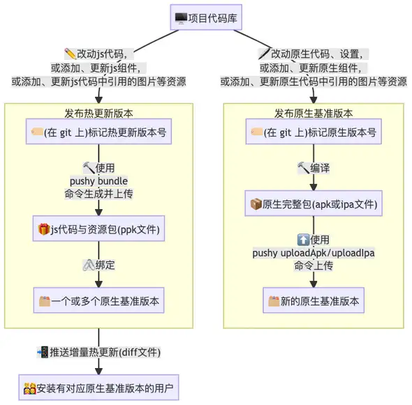

# code push 建议 rn 版本 > 6.0
* 首先请在 `https://update.reactnative.cn` 注册帐号：

## 注意

> 请记得，任意在 ios 和 android 目录下的修改，一定要重新编译（npx react-native run-ios 或 run-android 命令编译，或在 Xcode/Android Studio 中重新编译）才能生效

## 安装

- 在你的项目根目录下运行以下命令：

```sh
# 先全局安装命令行工具，每台电脑只用装一次
npm i -g react-native-update-cli

# 然后在项目目录中安装热更新模块
npm i react-native-update
```

## Android 配置

1. 配置 MainApplication
2. 禁用 android 的 crunch 优化，在 android/app/build.gradle 中关闭此操作
3. 登录与创建应用 `https://update.reactnative.cn` 注册帐号

### MainApplication

- 在 MainApplication 中增加如下代码：

```java
// ... 其它代码

// ↓↓↓请注意不要少了这句import
import cn.reactnative.modules.update.UpdateContext;
// ↑↑↑

public class MainApplication extends Application implements ReactApplication {

  private final ReactNativeHost mReactNativeHost =
    // 老版本 RN 这里可能是 new ReactNativeHost(this)
    new DefaultReactNativeHost(this) {

    // ↓↓↓将下面这一段添加到 DefaultReactNativeHost 内部！
    @Override
    protected String getJSBundleFile() {
        return UpdateContext.getBundleUrl(MainApplication.this);
    }
    // ↑↑↑

    // ...其他代码
  }
}
```

### 禁用 android 的 crunch 优化

- android 会在生成 apk 时自动对 png 图片进行压缩，此操作既耗时又影响增量补丁的生成。为了保证补丁能正常生成，您需要在 android/app/build.gradle 中关闭此操作：

``` java
...
android {
    ...
    signingConfigs { ... }
    buildTypes {
        release {
            ...
            // 添加下面这行以禁用crunch
            crunchPngs false
        }
    }
}
...
```

### 登录与创建应用
* 首先请在 `https://update.reactnative.cn` 注册帐号，然后在你的项目根目录下运行以下命令：
``` yaml
pushy login
email: king436632@163.com
password: King436632
```
* 这会在项目文件夹下创建一个.update文件，注意不要把这个文件上传到 Git 等 CVS 系统上。你可以在.gitignore末尾增加一行.update来忽略这个文件。
* 登录之后可以创建应用。注意 `iOS` 平台和 `Android` 平台需要分开创建：
* 两次输入的名字可以相同，这没有关系。
```yaml
$ pushy createApp --platform ios
App Name: it-async-app
$ pushy createApp --platform android
App Name: it-await-app
```
* 如果你已经在网页端或者其它地方创建过应用，也可以直接选择应用：
```yaml
$ pushy selectApp --platform ios
1) 鱼多多(ios)
2) 招财旺(ios)

Total 2 ios apps
Enter appId: <输入应用前面的编号>
```
* 选择或者创建过应用后，你将可以在文件夹下看到`update.json`文件，其内容类似如下形式：
```json
{
    "ios": {
        "appId": 1,
        "appKey": "<一串随机字符串>"
    },
    "android": {
        "appId": 2,
        "appKey": "<一串随机字符串>"
    }
}
```


# 发布热更新

* 现在你的应用已经具备了检测更新的功能，下面我们来尝试发布并更新它。流程可参考下图：
<!--  -->

* 一般来说我们需要先发布原生基准版本，然后在基准版本之上迭代业务逻辑，发布热更新版本。如果迭代过程中有原生方面的修改，则需要发布新的基准版本。可以只保留一个原生基准版本，也可以多版本同时维护。

## 发布原生基准版本 

### Android
* 首先参考文档-打包 APK设置签名，然后在 android 文件夹下运行`./gradlew assembleRelease`或`./gradlew aR`，你就可以在`android/app/build/outputs/apk/release/app-release.apk`中找到你的应用包。


## 发布热更新版本
* 你可以尝试修改一行代码(譬如将版本一修改为版本二)，然后使用pushy bundle --platform <ios|android>命令来生成新的热更新版本。
```yaml
$ pushy bundle --platform android
# 以下信息自动输出
Bundling with React Native version:  0.22.2
<各种进度输出>
Bundled saved to: build/output/android.1459850548545.ppk
Would you like to publish it?(Y/N)
```
* 如果想要立即上传，此时输入 Y。当然，你也可以在将来使用pushy publish --platform android build/output/android.1459850548545.ppk来上传刚才打包好的热更新包。
```yaml
Uploading [========================================================] 100% 0.0s
Enter version name: <输入热更新版本名字，如1.0.0-rc>
Enter description: <输入热更新版本描述>
Enter meta info: {"ok":1}
Ok.
Would you like to bind packages to this version?(Y/N)
```
> 此时版本已经提交到 pushy 服务，但用户暂时看不到此更新，你需要先将特定的原生包版本绑定到此热更新版本上。
> 此时输入 Y 立即绑定，你也可以在将来使用pushy update --platform <ios|android>来对已上传的热更包和原生包进行绑定。除此以外，你还可以在网页端操作，简单的将对应的原生包版本拖到需要的热更新版本下即可。

```yaml
┌────────────┬──────────────────────────────────────┐
│ Package Id │               Version                │
├────────────┼──────────────────────────────────────┤
│   46272    │ 2.0(normal)                          │
├────────────┼──────────────────────────────────────┤
│   45577    │ 1.0(normal)                          │
└────────────┴──────────────────────────────────────┘
共 2 个包
输入原生包 id: 46272
```

版本绑定完毕后，服务器会在几秒内生成差量补丁，客户端就可以获取到更新了。

后续要继续发布新的热更新，只需反复执行pushy bundle命令即可。

恭喜你，至此为止，你已经完成了植入代码热更新的全部工作。

## 测试、发布与回滚
- 我们强烈建议您先发布一个测试包，再发布一个除了版本号以外均完全相同的正式包。

- 例如，假设我们有一个正式包，版本为1.6.0，那么可以修改版本号重新打包一个1001.6.0，以一个明显不太正常的版本号来标识它是一个测试版本，同时后几位相同，可以表明它和某个正式版本存在关联（内容/依赖一致）。

- 在每次往发布包发起热更新之前，先对测试包1001.6.0进行更新操作，基本测试通过之后，再在网页后台上将热更包重新绑定到正式包1.6.0上。如果在测试包中发现了重大问题，你就可以先进行修复，更新测试确认通过后再部署到正式线上环境。这样，可以最大程度的避免发生线上事故。

- 万一确实发生线上事故需要回滚的话，首先利用版本控制系统回滚代码到正常的状态，然后重新生成热更包并推送即可。


# API参考
